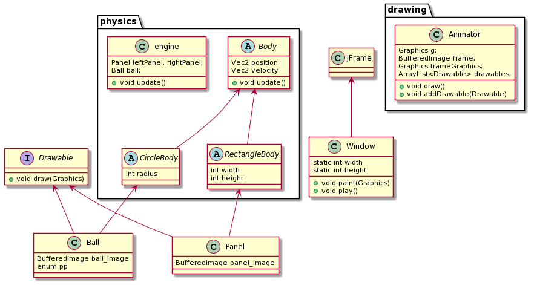

# Pong

Проект, содержащиий клон всемирно известной игры Pong.
Игра реализована на языке программирования Java
с использованием шаблона программирования MVC. Репозиторий представляет
собой проект intellij idea с некоторым дополнительными файлами и ресурсами.

## Сборка

Использовать стандартный шаблон idea Application с главным классом com.company.Main

## Устройство программы

Выше было отмечено, что игра реализована с использованием модели MVC,
ниже представленна диаграмма классов  и их описание.

  
Откуда диаграмма

    Файл <i>scheme</i> содержит исходный код диаграммы,
    для создания использовался онлайн сервис
    <a href="https://plantuml.com/ru/">PlantUML</a>. Библиотека находится в разработке
    и иногда дает сбоит(так и не вышло засунуть Drawable в пакет drawing), но для небольших
    проектов удобно использовать для быстрого описание структуры программы.

### Physics

Данный пакет отвечает за обработку физики: обновление положения объектов,
разрешение коллизий, реализацию наследственной структуры физических тел. Можно сказать, что 
Physics является реализаций Model в MVC.

* Начальный абстрактный класс _Body_ является основой для двух более конкретных типов тел:
круглого и прямоугольного. Тела — суть объекты, которое имеют позицию и скорость, в случае круга и прямоугольника еще и размеры.
  

* Класс _Engine_ является хранилищем и "мозгом" тел, он обрабатывает их движение и столкновения
между собой и с границами игрового поля. Также _Engine_ может устанавливать новый мяч по окончании раунда
  и транслировать координаты из привычных в координаты компьютерной графики и наоборот.

### Drawing

Небольшой пакет, отвечающий за отображение _Drawable_ объектов. Является реализацией View в MVC.

* Интерфейс _Drawable_ (который, к сожалению, не вошёл в пакет drawing на диаграмме) является основой
для всех объектов, которые мы будет рисовать.
  

* Класс _Animator_ хранит у себя ссылки на _Drawable_ объекты и рисует их по вызову draw(). Также отвечает
за некоторые декоративные элементы игры, подробнее можно узнать в исходном коде. 
  
### Всё, что не вошло в предыдущие два пакета

Первое, что стоит отметить — это _Window_. Window реализует последнюю часть MVC и как раз-таки отвечает
за взаимодействие с пользователем, за логику игры. _Window_ реагирует на нажатия клавиш, следит за счетом
и содержит главный цикл игры, в последнем происходит обновление физики и графики. _Window_ создает игровые объекты
и передает их физике и графике, об этих объектах написано ниже.

* _Ball_ - игровой мяч, наследует _CircleBody_ и реализует _Drawable_. Содержит
enum _pp_(player point), которые отвечает за то, кому стоит отдать очко в случае вылета мячика за
  игровое поле.

* _Panel_ - левая и правая панель, наследует _RectangleBody_ и реализует _Drawable_

Оба объекта имеют текстуры, которые хранятся в корне репозитория.

* _Vec2_ - вспомогательный класс векторов, используется для хранения скоростей и положений
объектов, абсолютно стандартная реализация.